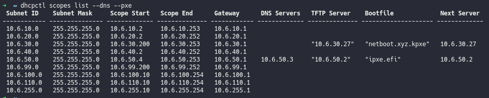
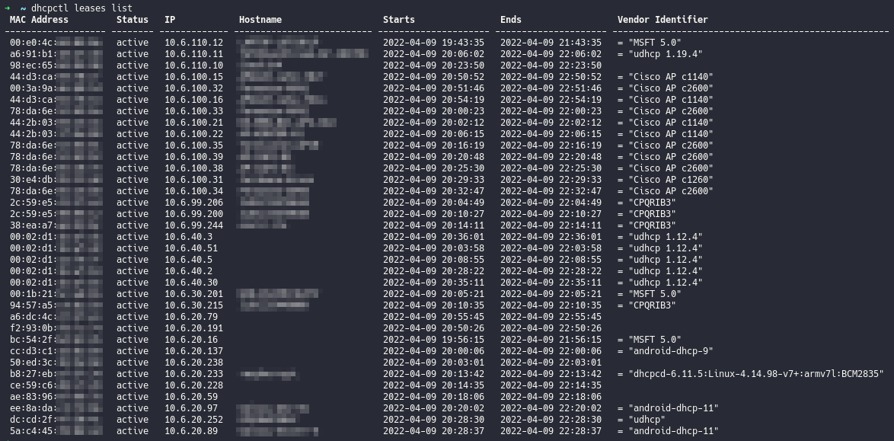
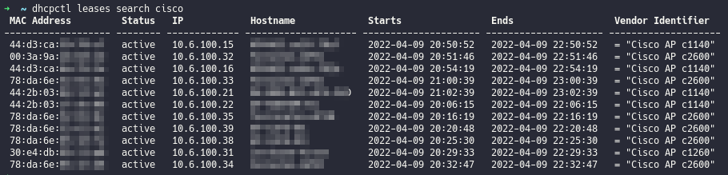
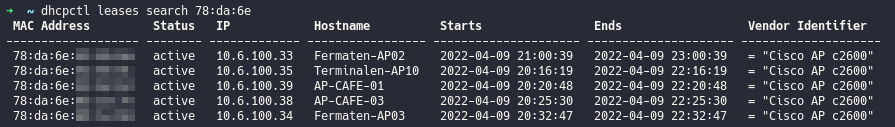

# isc-dhcp-cli

This is a CLI tool i made for my [ISC DHCP API](https://github.com/Kerwood/isc-dhcp-api) service.

With this tool you will be able to get the global configuration, list current scopes, list all leases or list all leases in a range. You can also search for leases by MAC, Hostname or Vendor Identifier. It's also possible to do a MAC vendor lookup on all leases with the `--mac-lookup` parameter.

```
dhcpctl 0.1.0
Author Patrick Kerwood <patrick@kerwood.dk>

USAGE:
    dhcpctl <SUBCOMMAND>

FLAGS:
    -h, --help       Prints help information
    -V, --version    Prints version information

SUBCOMMANDS:
    config     Set URL and/or auth token.
    globals    Get DHCP global configuration.
    help       Prints this message or the help of the given subcommand(s)
    leases     Get all DHCP leases.
    scopes     Get all DHCP scopes.
```

## Exampels

Set the url to the ISC DHCP API. If you are using a authentication token, set that to.

```sh
dhcpctl config set --url http://ip-or-url-to-the-api --token token-here
```

### List all configured scopes.



### List all leases.



### List a range of leases.


### List a range of leases and make vendor lookups on MACs.


### Below are three examples on searching leases.





